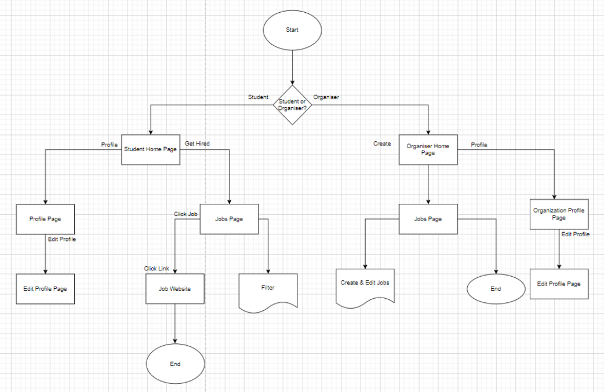
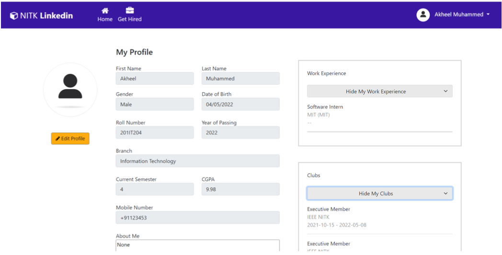
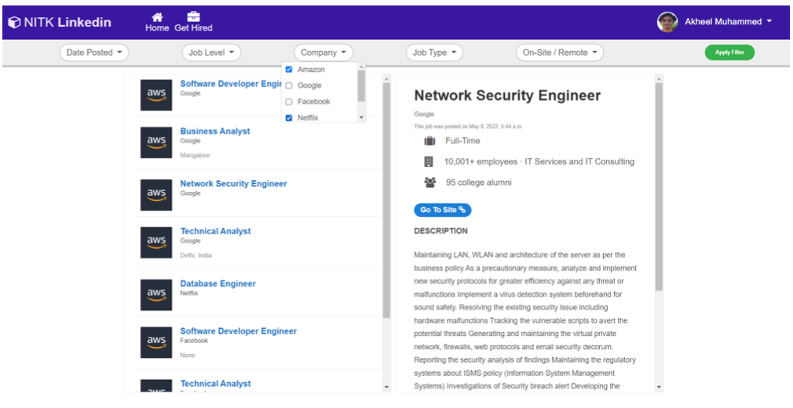
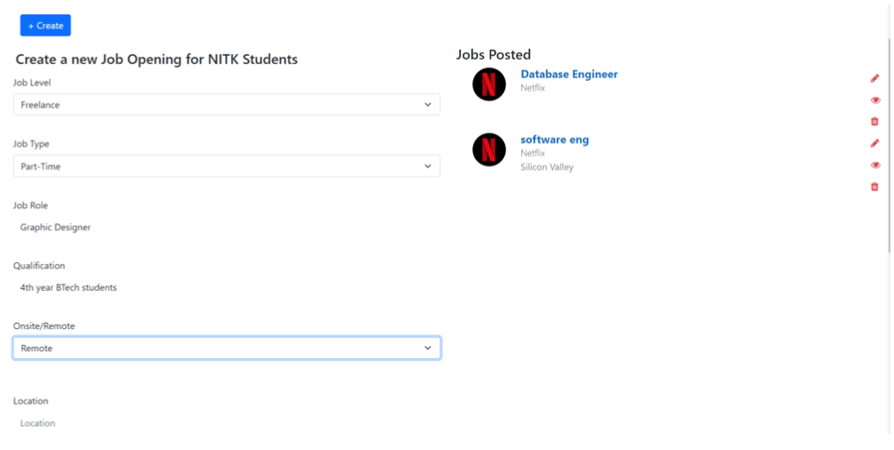

# IT254_NITKLinkedIn

### requirements:

`pip install Pillow` for imagefields in models (sometimes necessary to install)

## Project
- A web portal which has two types of users: students and organizations. Organizations can post internship and placement opportunities on this portal. Students can view all the vacancies and select and apply based on their interests using filters like company, job type (part-time/full-time), location, on-site/remote, industry, etc. 
- We have implemented this portal using HTML, CSS, JavaScript and Django.

## Flow Chart

## Results

- Student Profile Page 

- Student Job Page

- Organization Job Page

